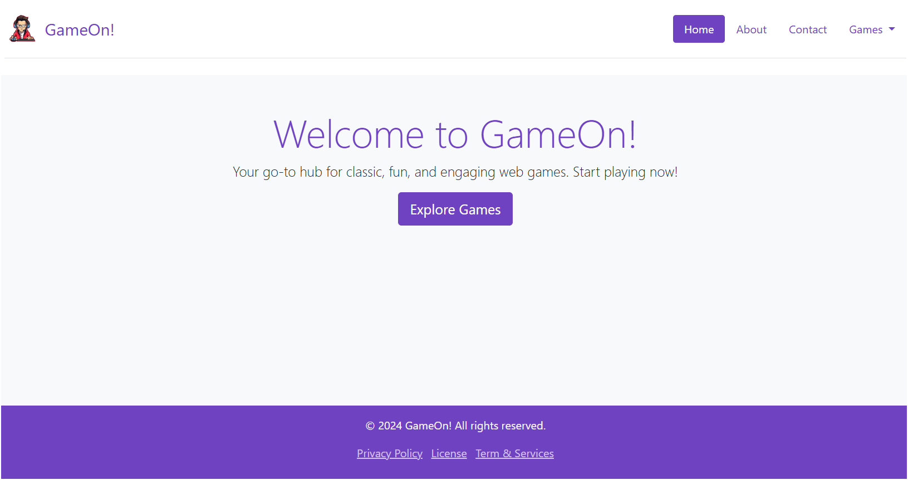

# GameOn! 🎮

Welcome to **GameOn!**, your one-stop destination for fun, engaging, and challenging web games! Whether you're into puzzles, action, arcade, or strategy, we've got something for everyone. Play solo to test your skills or challenge your friends for ultimate bragging rights. With new games added regularly, the fun never ends!

---

## 🚀 Features

- **Variety of Games**: Enjoy a wide selection of games including puzzles, action, arcade, and strategy.
- **Multiplayer Mode**: Challenge your friends and compete for the top score.
- **Regular Updates**: New games are added regularly to keep the experience fresh.
- **Interactive UI**: User-friendly and intuitive interface for all ages.

---

## 📜 How to Run

1. Clone the repository to your local machine:
    ```bash
    git clone https://github.com/Yugal-kosamshile/Interactive-Web-game
    ```

2. Navigate to the project folder:
    ```bash
    cd Interactive-Web-Game
    ```

3. Open `index.html` in your browser to start playing.

---

## 💻 Technologies Used

- **HTML**: Structure of the website.
- **CSS**: Styling and layout.
- **JavaScript**: Core game logic and interactivity.

---

## 🕹️ Games Included

1. **Puzzles**: Test your problem-solving skills with exciting puzzles.
2. **Action**: Fast-paced games to keep you on the edge of your seat.
3. **Strategy**: Plan and think ahead to outsmart your opponent.

---

## 🌟 Example Output



---

## 📜 License

This project is licensed under the [MIT License](LICENSE).

---

## 📧 Contact

If you have any questions, suggestions, or feedback, feel free to reach out:

- **Email**: Yugalkosamshile2002@gmail.com
- **GitHub**: [Yugal-kosamshile](https://github.com/Yugal-kosamshile)

---

Enjoy the fun and challenge of **GameOn!** 🎉
